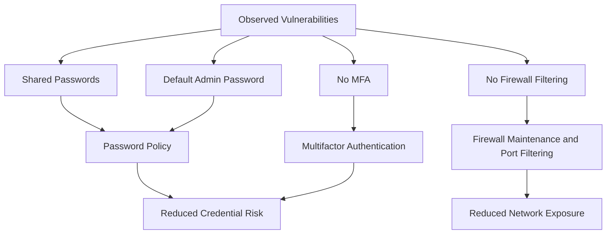

# Network Hardening Risk Assessment

## Overview

This project presents a simulated security risk assessment for a social media organization that experienced a data breach involving customer personal information. The scenario focuses on identifying network and access-control weaknesses, selecting practical hardening methods, and explaining how those methods reduce the risk of future breaches.

## Visual Overview

## Disclaimer

This is a scenario-based portfolio project. It is not a real employer incident. I analyzed the provided scenario and created original portfolio documentation.

## Scenario Summary

| Area | Detail |
| --- | --- |
| Organization type | Social media organization |
| Incident | Major data breach involving customer names and addresses |
| Main concern | Weak network and account security controls |
| Vulnerabilities identified | Shared employee passwords, default database admin password, missing firewall filtering rules, no MFA |
| Selected hardening methods | MFA, password policy and access control, firewall maintenance and port filtering |

## Repository Contents

| File | Purpose |
| --- | --- |
| `security-risk-assessment.md` | Main risk assessment report |
| `hardening-tools-selected.md` | Summary of selected hardening tools and methods |
| `vulnerability-analysis.md` | Analysis of the four vulnerabilities in the scenario |
| `remediation-plan.md` | Recommended remediation plan and implementation cadence |
| `portfolio-summary.md` | Interview-friendly project summary |

## Skills Demonstrated

* Network hardening analysis
* Vulnerability prioritization
* Access control recommendations
* MFA and password policy evaluation
* Firewall and port filtering concepts
* Security risk documentation
* Remediation planning

## Key Recommendation

The strongest immediate improvements are to enforce MFA for administrative and employee accounts, replace default/shared passwords with a formal password policy, and implement firewall rules with port filtering to control inbound and outbound traffic.
