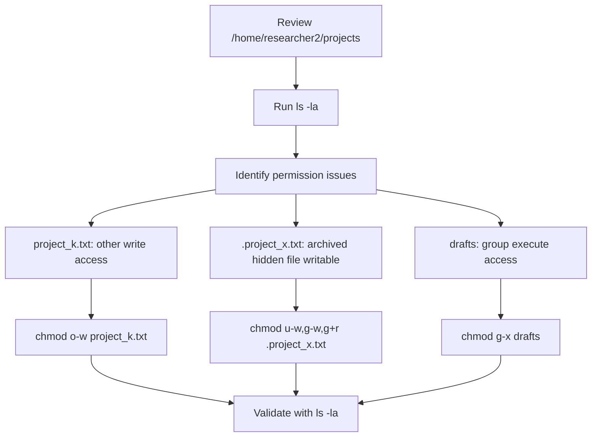

# Linux File Permissions Access Control

## Overview

This project documents a hands-on Linux access control exercise for a simulated research team environment. I reviewed file and directory permissions, identified excessive access, and used Linux commands to enforce least privilege across regular files, a hidden archived file, and a restricted directory.

The work focuses on practical command-line administration: using `ls -la` to inspect permissions, interpreting Linux permission strings, and applying `chmod` to remove unauthorized access.

## Visual Overview

## Disclaimer

This is a scenario-based portfolio project from a controlled Linux lab environment. It is not a real employer system. The project is included to demonstrate Linux permissions, access control, and least-privilege administration skills.

## Scenario Summary

| Item | Detail |
| --- | --- |
| Environment | Linux research team file system |
| Working directory | `/home/researcher2/projects` |
| Main task | Review and correct file and directory permissions |
| Security goal | Remove unauthorized write and directory access |
| Key commands | `pwd`, `ls`, `ls -la`, `chmod` |
| Access control principle | Least privilege |

## Repository Contents

| File | Purpose |
| --- | --- |
| `permission-review.md` | Review of the starting permission state and identified risks |
| `chmod-remediation.md` | Explanation of the permission changes made with `chmod` |
| `command-evidence.md` | Screenshots and command evidence from the completed Linux lab |
| `portfolio-summary.md` | Interview-friendly project summary |
| `assets/evidence/` | Terminal screenshots captured during the lab |

## Permission Changes

| Target | Issue | Command Used | Final Permission Goal |
| --- | --- | --- | --- |
| `project_k.txt` | Others had write access | `chmod o-w project_k.txt` | Remove write access from others |
| `.project_x.txt` | Hidden archived file had write permissions | `chmod u-w,g-w,g+r .project_x.txt` | User and group can read; nobody can write |
| `drafts` | Group had execute access | `chmod g-x drafts` | Only the owner can access the directory |

## Skills Demonstrated

* Linux command-line navigation
* File and directory permission review
* Hidden file inspection with `ls -la`
* Permission string interpretation
* `chmod` access control changes
* Least-privilege remediation
* Security documentation

## Key Takeaway

Small permission errors can create avoidable security risk. By inspecting all files, including hidden files, and removing unnecessary access with `chmod`, Linux administrators can reduce exposure and keep sensitive team directories aligned with least-privilege expectations.
