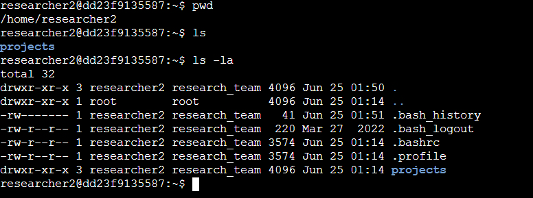
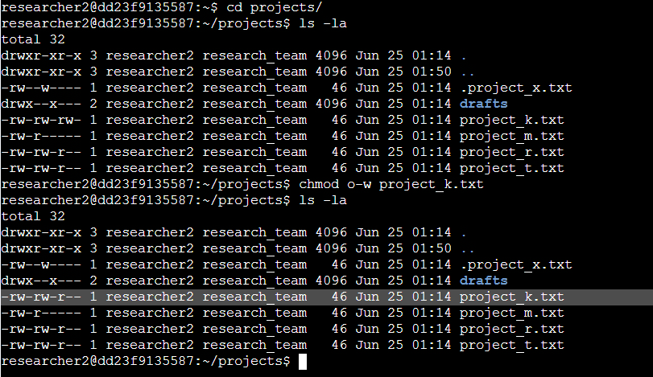
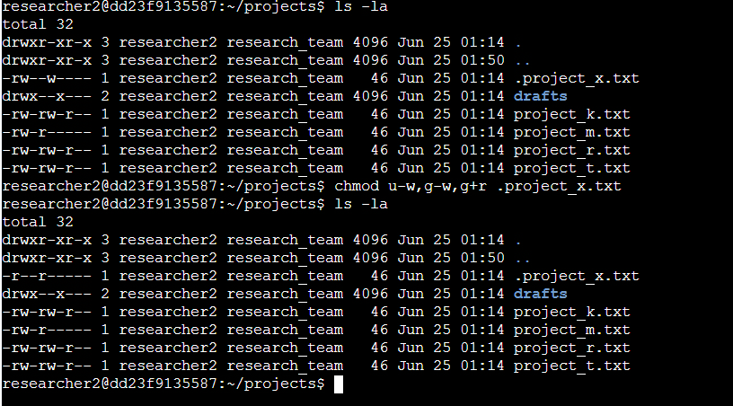
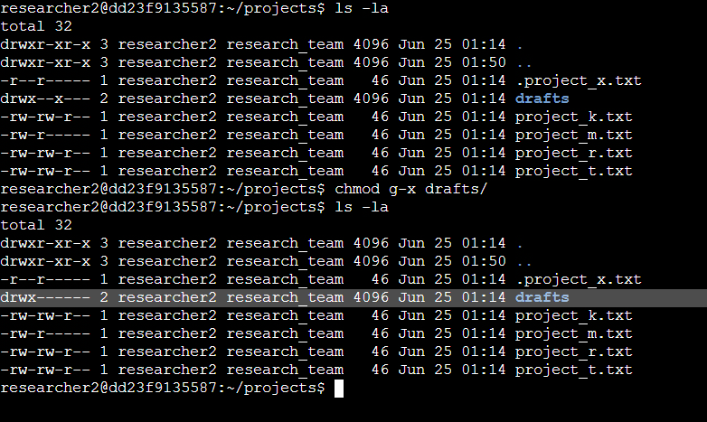

# Command Evidence

## Evidence Overview

The screenshots below show the Linux commands used to inspect and remediate file permissions in the lab environment.

## Directory Navigation and Listing



This screenshot shows use of `pwd`, `ls`, and `ls -la` to confirm the current location and inspect directory contents.

## Removing Other Write Access



This screenshot shows the starting permissions inside `~/projects`, then the command:

```bash
chmod o-w project_k.txt
```

The follow-up `ls -la` output confirms that `project_k.txt` no longer grants write access to others.

## Fixing Hidden Archived File Permissions



This screenshot shows the command:

```bash
chmod u-w,g-w,g+r .project_x.txt
```

The follow-up `ls -la` output confirms that `.project_x.txt` was changed to read-only access for the user and group, with no access for others.

## Restricting the Drafts Directory



This screenshot shows the command:

```bash
chmod g-x drafts/
```

The follow-up `ls -la` output confirms that the `drafts` directory is restricted to the owner.
