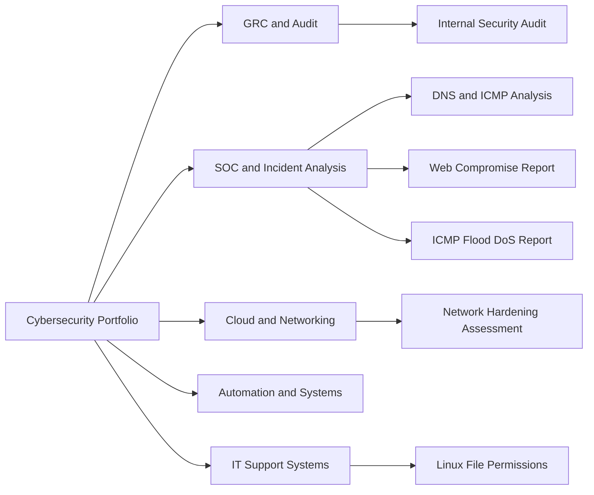

# Cybersecurity Portfolio

This portfolio contains selected cybersecurity projects focused on GRC, audit readiness, SOC analysis, IT support systems, cloud, networking, and automation.

## Portfolio Map

| Project                                          | Area                                      | Status    |
| ------------------------------------------------ | ----------------------------------------- | --------- |
| Internal Security Audit Case Study - Botium Toys | GRC / Audit / Risk                        | Completed |
| DNS and ICMP Traffic Analysis: UDP Port 53 Unreachable | Network Traffic Analysis / DNS / ICMP | Completed |
| Web Compromise Incident Report: Brute Force Attack and Malware Redirect | Incident Documentation / HTTP / Brute Force | Completed |
| ICMP Flood DoS Incident Report Using the NIST CSF | Incident Response / DoS / NIST CSF | Completed |
| Network Hardening Risk Assessment | Network Hardening / Access Control / Firewalling | Completed |
| Linux File Permissions Access Control | Linux / IAM / Least Privilege | Completed |
| Wazuh SOC Mini Lab                               | SOC / SIEM / Incident Triage              | Planned   |
| Active Directory Helpdesk Lab                    | IT Support / IAM / Windows Administration | Planned   |

## Focus Areas

* Governance, Risk, and Compliance
* Security audit readiness
* SOC and log analysis
* IT support and systems administration
* Linux access control
* Cloud and networking foundations
* Automation and scripting
