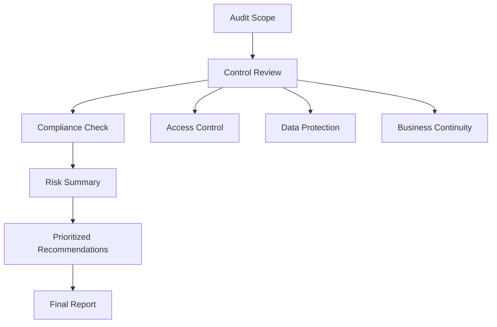

# Internal Security Audit Case Study - Botium Toys

## 1. Overview

This project is a polished security audit case study based on a fictional company scenario. The goal was to review security controls, identify risk, and present practical recommendations in a format suitable for a beginner GRC or security analyst portfolio.

## Visual Overview

## 2. Objective

The objective was to evaluate Botium Toys security posture, document control gaps, review compliance alignment, and recommend improvements that reduce business risk and protect sensitive customer and cardholder data.

## 3. Scenario

Botium Toys is a fictional toy company that sells products online and in person. The company stores and processes internal data that may include customer and payment information. The audit focused on whether current controls are strong enough to support access control, data protection, business continuity, and compliance expectations.

## 4. Skills Demonstrated

* Security auditing
* Risk assessment
* GRC fundamentals
* Control assessment
* Compliance review
* Administrative, technical, and physical control classification
* Business continuity and disaster recovery awareness
* Access control and data protection

## 5. Frameworks and Concepts Used

* NIST Cybersecurity Framework concepts
* PCI DSS awareness
* GDPR awareness
* SOC Type 1 and SOC Type 2 awareness
* Least privilege
* Separation of duties
* Encryption
* Asset and data classification
* Security control evaluation

## 6. Audit Scope

The audit reviewed internal assets, current security controls, access management practices, data protection controls, physical security controls, business continuity readiness, and compliance alignment with PCI DSS, GDPR, and SOC Type 1 and SOC Type 2 expectations.

## 7. Key Findings

Botium Toys has several important controls in place, including a firewall, antivirus software, office locks, CCTV surveillance, fire detection and prevention systems, breach notification procedures, privacy processes, and data integrity controls.

The main gaps are in access management, encryption, disaster recovery, backups, intrusion detection, password management, and asset classification. These gaps increase the chance of unauthorized access, data exposure, compliance issues, and business disruption.

## 8. Risk Summary

Overall risk is rated High. The highest risk areas involve broad employee access to internal data, lack of encryption for sensitive data, missing disaster recovery and backup procedures, no intrusion detection system, and weak password controls.

## 9. Recommendations

* Apply least privilege and separation of duties.
* Encrypt sensitive customer and cardholder data.
* Create and test backup and disaster recovery procedures.
* Deploy an intrusion detection system or IDS IPS solution.
* Strengthen password rules and use centralized password management.
* Classify and inventory data and assets.
* Create a formal schedule for legacy system maintenance.
* Continue maintaining existing physical and technical controls.

## 10. Deliverables

* [Executive Summary](./executive-summary.md)
* [Audit Methodology](./audit-methodology.md)
* [Control Assessment](./control-assessment.md)
* [Compliance Assessment](./compliance-assessment.md)
* [Risk Summary](./risk-summary.md)
* [Prioritized Recommendations](./prioritized-recommendations.md)
* [Lessons Learned](./lessons-learned.md)
* [Final Security Audit Report](./final-report/botium-toys-security-audit-report.md)

## 11. What I Learned

This project helped me understand how audit evidence supports control decisions and how technical issues connect to business risk. It also showed me why access control, encryption, backups, disaster recovery, and clear documentation are important parts of a strong security program.

## 12. Disclaimer

This project is based on a fictional company scenario. It does not represent a real company audit. The public repository contains only rewritten portfolio-ready documentation.
