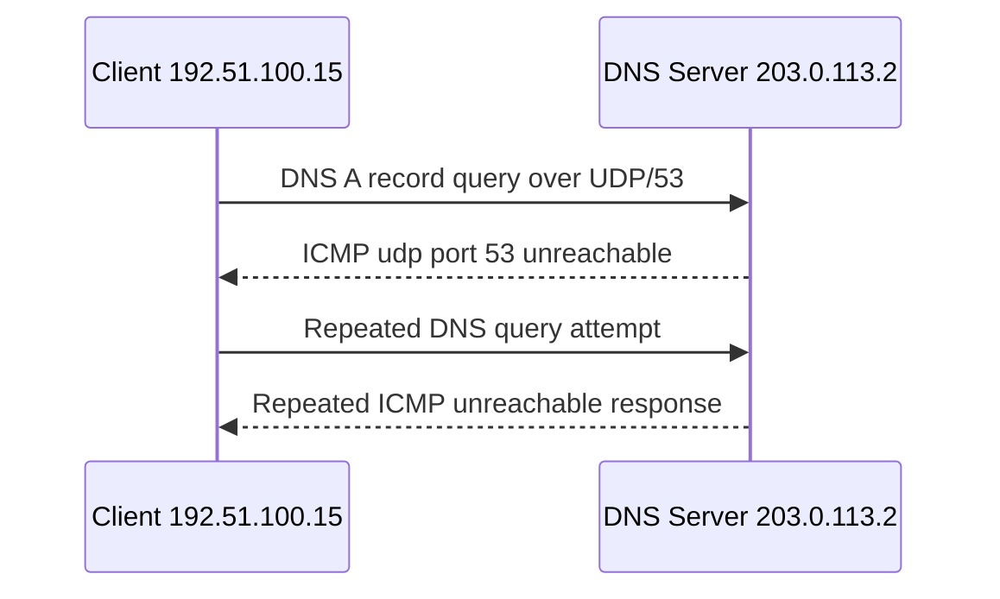

# DNS and ICMP Traffic Analysis: UDP Port 53 Unreachable

## Overview

This project documents a simulated network traffic analysis scenario. The scenario focuses on a website access issue where users could not reach `www.yummyrecipesforme.com` because DNS resolution was failing.

Using sanitized `tcpdump` output, I analyzed repeated DNS A record queries from a client to a DNS server and identified ICMP responses indicating that UDP port 53 was unreachable.

## Visual Overview

## Disclaimer

This is a scenario-based portfolio project. It is not a real employer incident, and I did not fix a live production issue. My role was to analyze the provided traffic, document the likely issue, and recommend next investigation and remediation steps.

## Scenario Summary

| Item | Detail |
| --- | --- |
| Reported issue | Users could not access `www.yummyrecipesforme.com` |
| Client IP | `192.51.100.15` |
| DNS server IP | `203.0.113.2` |
| Service affected | DNS |
| Protocols observed | DNS, UDP, ICMP |
| Port affected | UDP port 53 |
| Time window | Approximately 13:24 to 13:28 |
| Main finding | DNS queries received ICMP `udp port 53 unreachable` errors |

## Repository Contents

| File | Purpose |
| --- | --- |
| `incident-report.md` | Executive-style incident analysis and impact summary |
| `tcpdump-analysis.md` | Breakdown of the sanitized tcpdump lines and key fields |
| `remediation-plan.md` | Recommended next steps for troubleshooting and recovery |
| `sanitized-tcpdump-log.txt` | Sanitized traffic sample used for analysis |
| `glossary.md` | Simple definitions of DNS, UDP, ICMP, ports, and tcpdump fields |
| `portfolio-summary.md` | Interview-friendly project summary |

## Key Finding

The client repeatedly attempted to resolve `yummyrecipesforme.com` by sending DNS A record queries to `203.0.113.2` over UDP port 53. The DNS server responded with ICMP errors stating that UDP port 53 was unreachable. This suggests that DNS on the server was unavailable, blocked, misconfigured, or not listening on UDP port 53.

## Skills Demonstrated

* Network traffic analysis
* DNS troubleshooting
* ICMP error interpretation
* UDP port/service identification
* Incident documentation
* TCP/IP model understanding

## Lessons Learned

* A website access problem can be caused by DNS resolution failure before any HTTP or HTTPS connection is attempted.
* ICMP errors can provide useful evidence about service availability and port reachability.
* Repeated DNS queries with repeated ICMP errors point toward a service, firewall, or listener issue rather than a browser only issue.
* Clear incident documentation should separate observations, likely causes, and recommended next steps.
