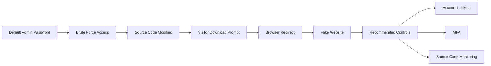

# Web Compromise Incident Report: Brute Force Attack and Malware Redirect

## Overview

This project documents a simulated cybersecurity incident involving a compromised cooking website, `yummyrecipesforme.com`. In the lab scenario, an attacker gained access to the web administration panel through a brute force attack, modified the website source code, and caused visitors to download a suspicious executable that redirected browsers to a fake website.

The purpose of this portfolio project is to show clear incident documentation, tcpdump interpretation, protocol identification, and practical remediation recommendations.

## Visual Overview

## Disclaimer

This is a scenario-based portfolio project. It is not a real employer incident. I did not remediate a production system; I analyzed the provided scenario and tcpdump evidence, documented the incident, and recommended controls.

## Scenario Summary

| Item | Detail |
| --- | --- |
| Affected website | `yummyrecipesforme.com` |
| Redirect destination | `greatrecipesforme.com` |
| Initial discovery | Customer reports to the helpdesk |
| Confirmed issue | Website source code was modified to prompt visitors to download an executable |
| Initial access method | Brute force attack against the admin account |
| Contributing weakness | Default admin password and no effective brute force prevention controls |
| Main protocol identified | HTTP |
| Supporting protocols observed | DNS and TCP |
| Recommended control | Limit failed login attempts and lock or delay repeated authentication attempts |

## Repository Contents

| File | Purpose |
| --- | --- |
| `incident-report.md` | Formal portfolio incident report |
| `tcpdump-analysis.md` | Breakdown of DNS, TCP, and HTTP events in the traffic log |
| `remediation-plan.md` | Recommended response and prevention steps |
| `sanitized-tcpdump-log.txt` | Sanitized tcpdump sample used for analysis |
| `glossary.md` | Definitions of key terms and tcpdump fields |
| `portfolio-summary.md` | Interview-friendly project summary |

## Skills Demonstrated

* Security incident documentation
* Network protocol identification
* Tcpdump traffic analysis
* HTTP and DNS troubleshooting
* Brute force attack analysis
* Malware redirect investigation
* Remediation planning

## Key Takeaway

The tcpdump log helped show the normal sequence of DNS resolution, TCP connection setup, and HTTP web requests. The security issue was not simply that traffic reached the website. The key issue was that the legitimate website had been modified after an attacker gained administrative access, causing visitors to download and execute a file that redirected them to a malicious destination.
