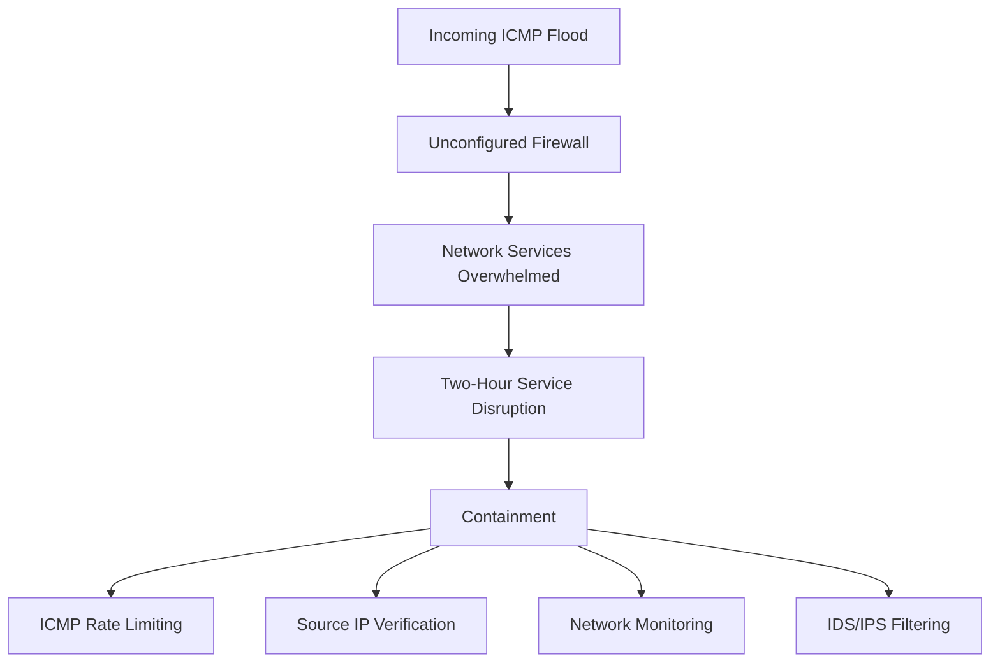

# ICMP Flood DoS Incident Report Using the NIST CSF

## Overview

This project documents a simulated denial-of-service incident affecting a multimedia company. The organization experienced a two-hour internal network outage after a malicious actor sent a flood of ICMP packets through an unconfigured firewall.

The incident is analyzed using the National Institute of Standards and Technology Cybersecurity Framework (NIST CSF) functions: Identify, Protect, Detect, Respond, and Recover.

## Visual Overview

## Disclaimer

This is a scenario-based portfolio project. It is not a real employer incident. I analyzed the provided scenario and created original portfolio documentation to demonstrate incident reporting and NIST CSF mapping.

## Scenario Summary

| Item | Detail |
| --- | --- |
| Organization type | Multimedia company supporting web design, graphic design, and social media marketing |
| Incident type | Denial-of-service attack |
| Attack method | ICMP packet flood |
| Root vulnerability | Unconfigured firewall allowed excessive incoming ICMP traffic |
| Impact | Internal network services were unavailable for approximately two hours |
| Initial response | Blocked incoming ICMP packets, took non-critical services offline, restored critical network services |
| Post-incident controls | ICMP rate limiting, source IP verification, network monitoring, IDS/IPS filtering |

## Repository Contents

| File | Purpose |
| --- | --- |
| `incident-report-analysis.md` | Main incident report mapped to NIST CSF functions |
| `nist-csf-action-plan.md` | Action plan organized by Identify, Protect, Detect, Respond, Recover |
| `detection-and-monitoring-plan.md` | Monitoring and alerting recommendations for similar attacks |
| `response-and-recovery-plan.md` | Future response and recovery workflow |
| `lessons-learned.md` | Key takeaways from the simulated incident |
| `portfolio-summary.md` | Interview-friendly summary |

## Skills Demonstrated

* Incident report writing
* NIST CSF mapping
* DoS attack analysis
* ICMP traffic risk assessment
* Firewall hardening recommendations
* IDS/IPS and network monitoring concepts
* Response and recovery planning

## Key Takeaway

The incident shows how a basic firewall configuration gap can allow high-volume ICMP traffic to disrupt internal network availability. A strong response plan should combine firewall rule tuning, monitoring, IDS/IPS filtering, and documented recovery procedures.
