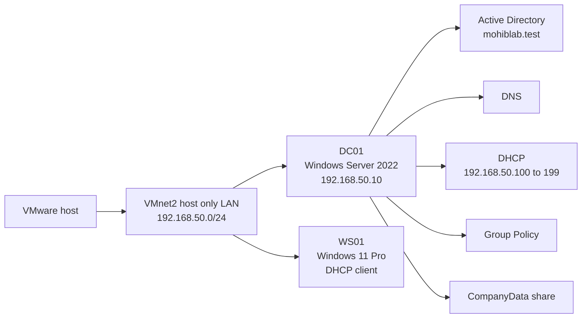
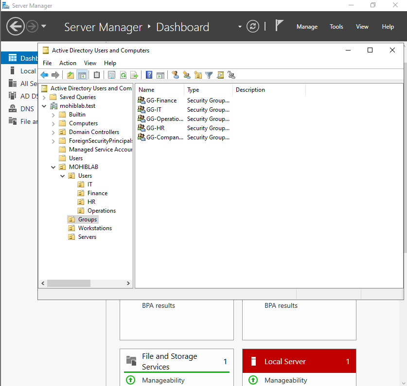
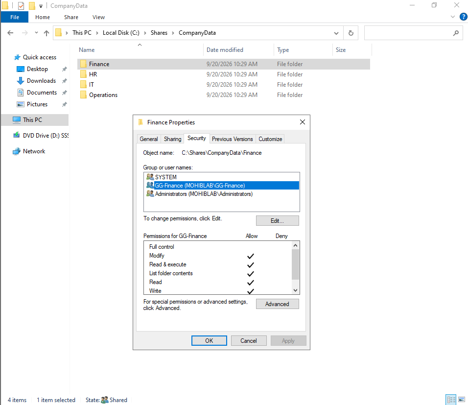
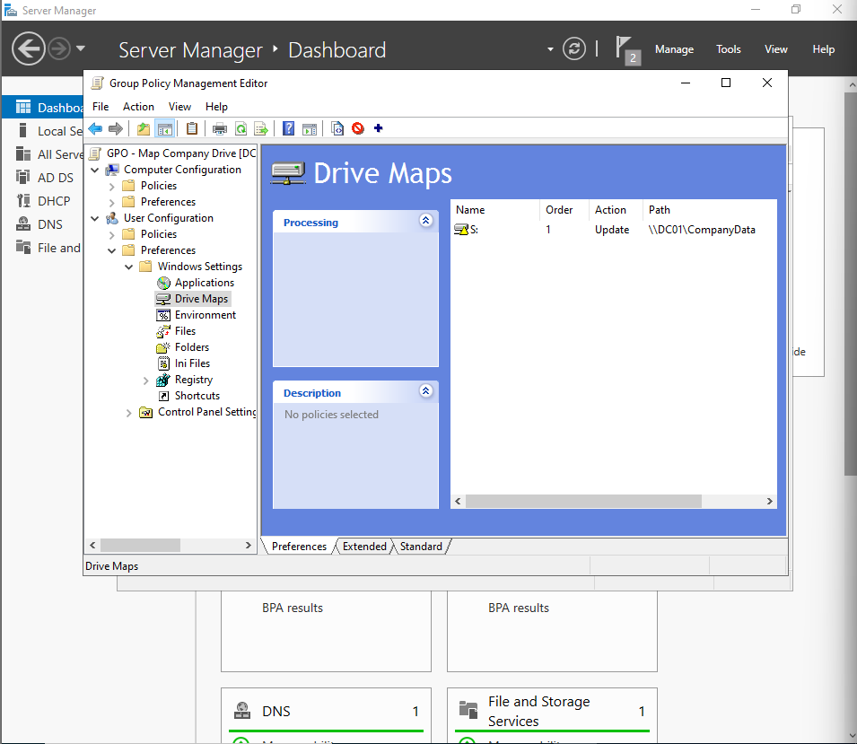
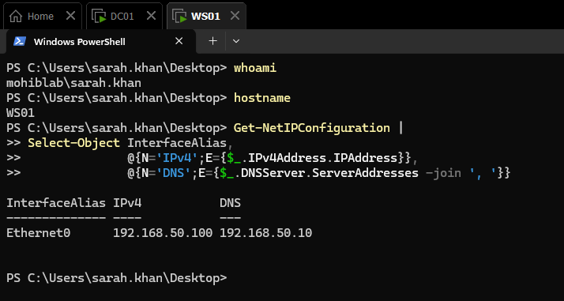
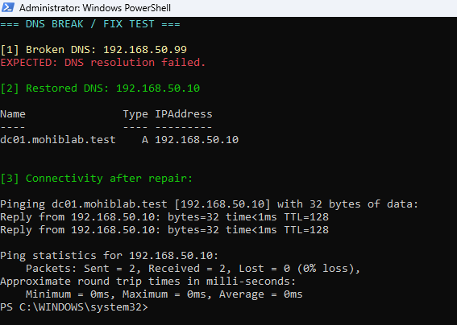
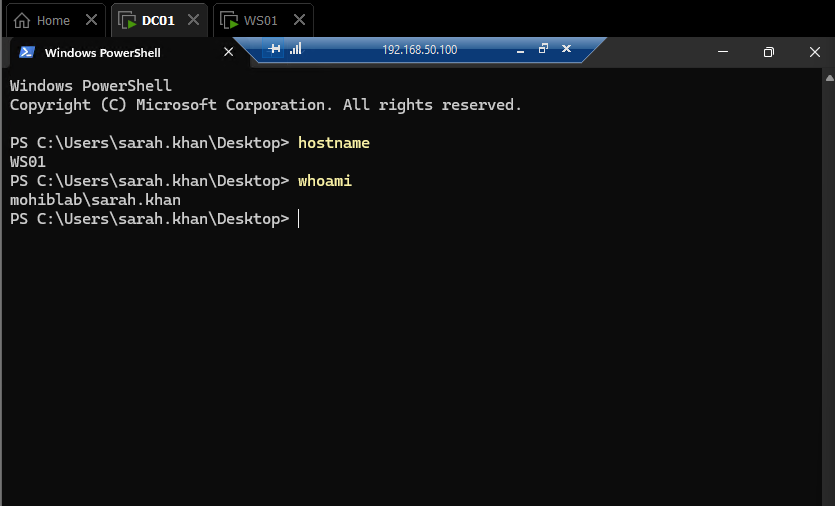

# Windows Server and Active Directory Support Lab

This is the main hands on IT project in my portfolio.

I built a small Windows domain in VMware because I wanted practice with the sort of stuff that comes up in IT support and junior Windows admin work, not just theory.

## Setup

| Component | Setup |
| --- | --- |
| Domain controller | DC01, Windows Server 2022 |
| Client | WS01, Windows 11 Pro |
| Domain | `mohiblab.test` |
| DC01 IP | `192.168.50.10/24` |
| DHCP scope | `192.168.50.100` to `192.168.50.199` |
| Client DNS | `192.168.50.10` |
| Network | VMware VMnet2 host only |

## What I built

* promoted DC01 to a domain controller and created `mohiblab.test`
* configured DNS and DHCP on DC01
* created OUs, users, and department security groups
* created `\\DC01\CompanyData` with Finance, HR, IT, and Operations folders
* used security groups and NTFS permissions to control folder access
* used Group Policy to map the company share as `S:`
* joined WS01 to the domain and tested a domain user login
* used PowerShell to check users, group membership, services, DNS, and locked accounts
* set up a shared test printer and RDP

## Things I broke and fixed

Account lockout: I triggered the lockout policy, found the locked user, unlocked the account, and checked that it was cleared.

DNS: I pointed WS01 at the wrong DNS server, `192.168.50.99`, confirmed name resolution failed, then restored `192.168.50.10` and tested again.

Folder access: I confirmed a Finance user could use the Finance folder but got Access Denied for HR.

Printer: I stopped the Print Spooler, reproduced the printer query failure from the client, restarted the service, and tested it again.

RDP: I connected to WS01 remotely with the domain user and checked the hostname and logged in identity.

## Evidence

The screenshots below are all shown at the same width. Click one if you want the full size image.

### Active Directory structure

### NTFS permissions

### Group Policy drive mapping

### Domain client check

### DNS fix

### RDP check

Full screenshot set

1. [VMnet2 network](evidence/01-vmware-vmnet2.png)
2. [DC01 static IP](evidence/02-dc01-static-ip.png)
3. [Active Directory structure](evidence/03-active-directory-structure.png)
4. [DHCP scope](evidence/04-dhcp-scope.png)
5. [NTFS permissions](evidence/05-ntfs-permissions.png)
6. [Group Policy](evidence/06-group-policy.png)
7. [Domain join](evidence/07-domain-join.png)
8. [Domain user and client network check](evidence/08-domain-user-login.png)
9. [Mapped drive and access control](evidence/09-mapped-drive-and-permissions.png)
10. [Account lockout fix](evidence/10-account-lockout-resolution.png)
11. [DNS fix](evidence/11-dns-troubleshooting.png)
12. [PowerShell checks](evidence/12-powershell-admin.png)
13. [Printer troubleshooting](evidence/13a-printer-troubleshooting.png)
14. [Printer server check](evidence/13b-printer-server-validation.png)
15. [RDP check](evidence/14-rdp-validation.png)

## What actually clicked for me

This lab made the different Windows services make more sense together.

DHCP gives the client its network settings. DNS helps it find the domain and other hosts. Active Directory handles users, computers, groups, and authentication. Group Policy pushes settings such as the drive map. Security groups and NTFS permissions decide who can access what.

The troubleshooting part was the most useful because it forced me to figure out which layer was actually failing instead of changing random settings.

> Home lab for learning. I am not presenting this as enterprise work experience.
